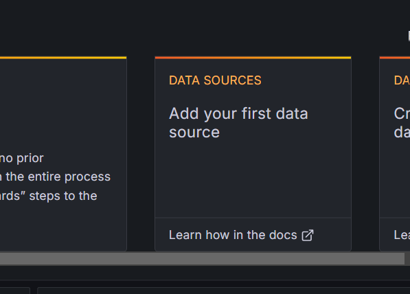

# h2-users-deploy
Proyecto para desplegar la app de administracion de usuarios. Este proyecto usa el siguiente stack


## Instalar

Instalar [Docker](https://docs.docker.com/get-docker/) dependiendo del sistema operativo

Instalar [Docker Compose](https://docs.docker.com/compose/install/) dependiendo del sistema operativo

Si usas Docker Desktop, docker compose ya viene incluido

Clonar este repositorio en el directorio de preferencia.
Luego en el mismo directorio clonar el seguiente repositorio también: 

[RepositorioApi](https://github.com/faillon/h2-users-api)


## iniciar-contenedores
```bash
docker-compose up -d
```

Este comando desplegará los contenerdores usados por esta aplicacion

## detener y eliminar los contenedores y volumenes
```bash
docker-compose down -v
```

Usar este comando para detener y borrar todos los contenedores y volumenes creados por el comando anterior

# Stack Tecnológico

## Spring Boot
Se elije Spring Boot por ser un framework Java ya maduro y que ayuda a crear una api de manera rápida.
Por otro lado Java es un lenguaje robusto con el que me siento comodo.
Servicio construido siguiendo Arquitectura Hexagonal.

## H2
Se elije DB en memoria H2 por la sencillez de uso. Además al ser necesario crear una relacion entre Usuarios y Telefonos se elije una BD SQL.


## Swagger
Para ayudar a documentar de una forma clara y además permitir hacer pruebas a la API se incluye definicion con openApi y la UI Swagger. Se puede ver la documentacion en el siguiente link.
http://localhost:8080/swagger-ui/index.html#/

## Redis
Para ayudar a optimizar las solicitudes a la api se incluye redis.

## Prometheus
Este proyecto incluye prometheus con spring boot actuator para monitoreo de la api. 
Para usarla se debe ir a http://localhost:9090/

## Grafana
Este proyecto incluye grafana para una mejor visualizacion de las metricas. Dirigirse a http://localhost:3006/

### Configuración Grafana
Para poder visualizar los dashboard seguir los siguientes pasos:


Ingresar los datos admin/admin


Hacer click en Skip


Seleccionar Data Sources


Seleccionar Prometheus


Escribir http://prometheus:9090/


Hacer click en boton Save & Test


En el menú ir a Dashboards


Seleccionar Create Dashboard


Hacer click en Import dashboard


Click Upload dashboard JSON file y seleccionar el archivo json incluido en este repositorio (12900_rev3.json)


Seleccionar Prometheus y hacer click en Import


Ya se puede ver el Dashboard